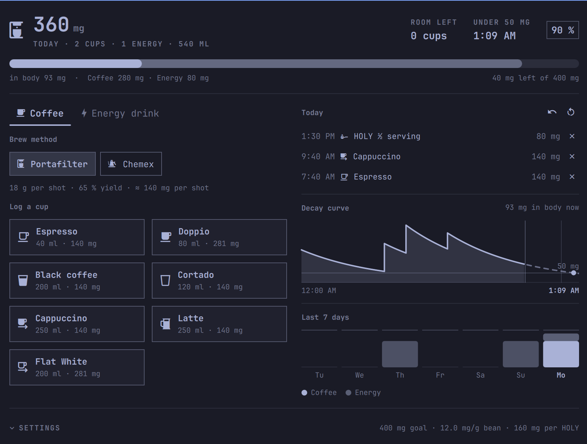

# Coffee Tracker

A caffeine tracker for the [Omarchy](https://omarchy.org/) bar. It counts
milligrams rather than cups, and it derives the milligrams from how the
drink is actually made instead of looking them up in a table.

The bar shows today's total from every source. Click it and the panel
behind it owns the one-tap cup buttons, the brew-method switch, the energy
roster, today's log, and the last seven days.



## Why it calculates instead of looking up

A cup of coffee has no fixed caffeine content — a ristretto and a 500 ml
filter brew from the same beans are not the same drink. Each source gets
the model that fits it:

| Source      | Model                                                    |
| ----------- | -------------------------------------------------------- |
| Portafilter | shots × dose × bean mg/g × extraction                    |
| Chemex      | ml/100 × brew ratio × bean mg/g × extraction             |
| Powder      | servings × mg per serving                                |
| Cans        | ml/100 × mg per 100 ml                                   |

Move the grind numbers and the whole coffee roster moves with them. Move
the serving strength and every powder portion follows. Cans are the one
fixed table, because their caffeine is a label fact rather than a choice.

Everything lands in the same day total, which is the point of tracking two
sources at once: 200 mg is 200 mg whether it came out of a portafilter or
a shaker.

## What it shows

- **Today's total** as a number and a bar filling toward your daily goal.
  The bar carries two fills: what you drank, and the brighter inner fill
  for what is still circulating after the half-life has had its way with
  it. The same total means something very different at 09:00 and at 22:00.
- **Room left** — how many more of your default cup fit under the goal.
- **When you drop under your residual threshold**, stepped forward from the
  current decay curve.
- **The decay curve** — the whole day as a shape: every drink is a step up,
  everything between the steps is the same exponential coming down at your
  half-life. The threshold is drawn across it, and where the curve crosses
  it is marked on the time axis, because that crossing is what you open a
  caffeine tracker in the evening to find out. Everything left of the
  now-marker happened; the dashed half to the right is the forecast if you
  drink nothing else.
- **The last seven days**, stacked by source, with the daily goal as a
  hairline across the columns.

Defaults follow the EFSA figure of 400 mg a day as a safe habitual intake
for a healthy adult, and a 5 h half-life, which is the population mean.
Both are settings, not verdicts — this is a tracker, not medical advice.

## Install

```bash
omarchy plugin add https://github.com/PhilippBellia/omarchy-coffee-tracker --enable
```

The widget lands on the right side of the bar. To place it yourself:

```bash
omarchy bar move io.github.philippbellia.coffee-tracker --section right
```

## Remove

```bash
omarchy plugin remove io.github.philippbellia.coffee-tracker
```

That removes the plugin and its bar entry. The drink log is user data and
is left alone; delete it separately if you want it gone:

```bash
rm ~/.local/state/omarchy/coffee-log.json
```

## Use it

| Action                | What it does                          |
| --------------------- | ------------------------------------- |
| Click                 | Open the panel                        |
| Middle-click          | Log the default cup                   |
| Right-click           | Take the last drink back              |

Inside the panel: `E` logs the default cup, `H` a powder serving, `U`
undoes, `M` switches brew method, `1` / `2` switch tabs, `,` opens the
settings.

From a script or a keybinding:

```bash
omarchy-shell coffee espresso    # log an espresso
omarchy-shell coffee holy        # log one powder serving
omarchy-shell coffee add doppio  # log any drink by id
omarchy-shell coffee undo        # take the last one back
omarchy-shell coffee clear       # clear today
omarchy-shell coffee today       # print today's summary
omarchy-shell coffee open        # open the panel
```

The IPC target stays `coffee` rather than the full plugin id, because it is
typed by hand into keybindings.

## Settings

The panel's own settings are behind the `EINSTELLUNGEN` / `SETTINGS`
disclosure at the bottom: daily limit, half-life, residual threshold, dose,
bean strength, extraction yields, powder serving, and the two toggles for
the bar label and the limit notification. They are written to
`~/.config/omarchy/shell.json` under this widget's entry.

## Language

The interface ships in English and German and picks one from your session
locale. Override it in the panel under **Language / Sprache**, where
`System` means "follow the locale". The language also decides the decimal
mark and the clock: English shows `8:53 AM`, German `08:53`.

### Adding a language

Every user-facing string lives in `locales/<code>.json` as a flat
`key → text` map. To add one:

1. Copy `locales/en.json` to `locales/<code>.json` and translate the values.
   Leave the keys alone.
2. Keep the positional placeholders (`%1`, `%2`, `%3`) — they are filled with
   numbers and names in order, and a sentence can reorder them freely.
3. Set the three `meta.` keys: `meta.name` to the language's name in that
   language, `meta.decimalSeparator` to `.` or `,` as that language writes
   decimals, and `meta.timeFormat` to a
   [Qt time format](https://doc.qt.io/qt-6/qtime.html#toString) — `HH:mm`
   for a 24-hour clock, `h:mm AP` for a 12-hour one with AM/PM.
4. Add the code to `available` in `I18n.qml` — one line, and it appears in
   the panel's picker.
5. Run the checker:

   ```bash
   python3 scripts/check-locales.py
   ```

A translation does not have to be complete. Missing keys fall back to
English at runtime, so a partial file is worth opening a pull request for.

## Data

The log lives in `~/.local/state/omarchy/coffee-log.json`, not in
`shell.json`: it is user data that grows, and every bar instance watches the
same file, so a drink logged on one monitor lands on the others too.
Entries older than 14 days are dropped on load — the week strip only looks
back seven, and a tracker should not quietly become an archive of every cup
ever pulled.

## Requirements

Omarchy Quattro (4.x) with the Omarchy shell. No external dependencies
beyond `notify-send` (part of `libnotify`, already present on Omarchy),
which is only used for the optional limit notification.

## License

MIT — see [LICENSE](LICENSE).
